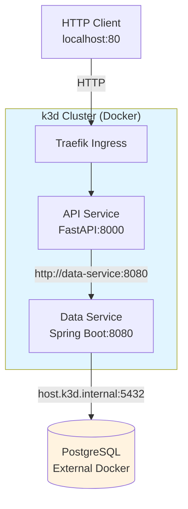

# k3d Local Development Setup

This directory contains the complete k3d configuration for running the three-tier microservices application locally.

## Overview

k3d is a lightweight wrapper to run k3s (Rancher Lab's minimal Kubernetes distribution) in Docker. It's fast, lightweight, and perfect for local development.

### Architecture



### Cluster Configuration

- **Cluster Name**: k3d-local-dev
- **Kubernetes Version**: Latest k3s
- **Nodes**: 1 server + 2 agents (workers)
- **Ingress Controller**: Traefik (built-in)
- **Local Registry**: registry.localhost:5000
- **Namespace**: dev
- **Network**: k8s-network (shared with PostgreSQL)

## Prerequisites

- **k3d** - [https://k3d.io/](https://k3d.io/)
- **kubectl** - [https://kubernetes.io/docs/tasks/tools/](https://kubernetes.io/docs/tasks/tools/)
- **Docker** - [https://docs.docker.com/get-docker/](https://docs.docker.com/get-docker/)

## Directory Structure

```
k3d-setup/
├── cluster-config.yaml       # k3d cluster configuration
├── README.md                 # This file
└── manifests/
    ├── namespace.yaml        # Namespace definition
    ├── configmap.yaml        # Application configuration
    ├── secrets.yaml          # Database credentials
    ├── data-deployment.yaml  # Data service deployment
    ├── api-deployment.yaml   # API service deployment
    ├── services.yaml         # Kubernetes services
    └── ingress.yaml          # Traefik ingress configuration
```

## Setup Steps

Follow these steps to set up your k3d cluster and deploy the three-tier application.

### 1. Verify Prerequisites

Check that all required tools are installed:

```bash
# Check k3d installation
k3d version

# Check kubectl installation
kubectl version --client

# Check Docker is running
docker ps
```

### 2. Create Docker Network

Create a shared Docker network for k3d cluster and PostgreSQL container:

```bash
# Create network (if it doesn't exist)
docker network create k8s-network

# Verify network exists
docker network inspect k8s-network
```

### 3. Start PostgreSQL Database

Start the external PostgreSQL container that will be accessed by the data-service:

```bash
# Navigate to postgres directory
cd ./external/postgres

# Start PostgreSQL with docker-compose
docker-compose up -d

# Verify PostgreSQL is running
docker ps | grep postgres-devdb

# Return to k3d-setup directory
cd ..
```

**Note**: PostgreSQL runs outside Kubernetes to demonstrate cross-network communication patterns.

### 4. Create k3d Cluster

Create the k3d cluster using the configuration file:

```bash
# Navigate to k3d-setup directory
cd ./k3d-setup

# Create cluster with configuration
k3d cluster create --config cluster-config.yaml

# This creates:
# - 1 server node (control plane)
# - 2 agent nodes (workers)
# - Local Docker registry at localhost:5000
# - Traefik ingress controller
# - Connection to k8s-network
```

Wait for the cluster to be ready:

```bash
# Wait for all nodes to be ready (max 2 minutes)
kubectl wait --for=condition=Ready nodes --all --timeout=120s

# Verify cluster info
kubectl cluster-info

# Check all nodes are ready
kubectl get nodes
```

You should see 3 nodes: 1 server and 2 agents, all in "Ready" status.

### 5. Build Docker Images

Build the microservice Docker images:

```bash
# Build API service (Python/FastAPI)
docker build -t api-service:latest ../services/api-service

# Verify api-service image was created
docker images | grep api-service

# Build data service (Java/Spring Boot)
docker build -t data-service:latest ../services/data-service

# Verify data-service image was created
docker images | grep data-service
```

### 6. Push Images to Local Registry

The k3d cluster includes a local Docker registry. Push your images to it:

```bash
# Tag api-service for local registry
docker tag api-service:latest localhost:5000/api-service:latest

# Push api-service to registry
docker push localhost:5000/api-service:latest

# Tag data-service for local registry
docker tag data-service:latest localhost:5000/data-service:latest

# Push data-service to registry
docker push localhost:5000/data-service:latest

# Verify images are in registry
curl http://localhost:5000/v2/_catalog
# Should show: {"repositories":["api-service","data-service"]}
```

### 7. Deploy Kubernetes Resources

Deploy all application components to the cluster in the correct order:

```bash
# Navigate to manifests directory
cd ./manifests

# 1. Create namespace
kubectl apply -f namespace.yaml

# 2. Create ConfigMap (non-sensitive configuration)
kubectl apply -f configmap.yaml

# 3. Create Secrets (database credentials)
kubectl apply -f secrets.yaml

# 4. Deploy data-service (Spring Boot)
kubectl apply -f data-deployment.yaml

# 5. Deploy api-service (FastAPI)
kubectl apply -f api-deployment.yaml

# 6. Create Kubernetes Services
kubectl apply -f services.yaml

# 7. Create Ingress for external access
kubectl apply -f ingress.yaml

# Return to k3d-setup directory
cd ..
```

### 8. Wait for Deployments to be Ready

Monitor the deployment rollout:

```bash
# Watch all pods in the dev namespace
kubectl get pods -n dev -w

# Or wait for data-service deployment to complete (max 5 minutes)
kubectl rollout status deployment/data-service -n dev --timeout=300s

# Wait for api-service deployment to complete (max 5 minutes)
kubectl rollout status deployment/api-service -n dev --timeout=300s
```

### 9. Verify Deployment

Check that all components are running:

```bash
# Check all pods are running
kubectl get pods -n dev

# Check services are created
kubectl get svc -n dev

# Check ingress is configured
kubectl get ingress -n dev

# View more details
kubectl get all -n dev
```

You should see:

- 2 api-service pods running
- 2 data-service pods running
- 2 services (api-service and data-service)
- 1 ingress (api-ingress)

### 10. Test the Application

Test the API endpoints:

```bash
# Health check
curl http://localhost/api/health

# Get all users
curl http://localhost/api/users

# Get specific user
curl http://localhost/api/users/1
```

**Success!** You now have a fully functional three-tier application running on k3d.

## Useful Commands

### Cluster Management

```bash
# List all clusters
k3d cluster list

# Stop cluster (preserves state)
k3d cluster stop k3d-local-dev

# Start stopped cluster
k3d cluster start k3d-local-dev

# Delete cluster completely
k3d cluster delete k3d-local-dev

# Get kubeconfig for cluster
k3d kubeconfig get k3d-local-dev
```

### Monitoring

```bash
# Watch pods in real-time
kubectl get pods -n dev -w

# View api-service logs (follow mode)
kubectl logs -f deployment/api-service -n dev

# View data-service logs (follow mode)
kubectl logs -f deployment/data-service -n dev

# View logs from all api-service pods
kubectl logs -l app=api-service -n dev

# Describe a specific pod
kubectl describe pod <pod-name> -n dev

# Get recent events sorted by timestamp
kubectl get events -n dev --sort-by='.lastTimestamp'

# Port forward service (alternative to ingress)
kubectl port-forward svc/api-service 8000:8000 -n dev
```

## Cleanup

When you're done, clean up all resources:

```bash
# Delete the k3d cluster (removes cluster, registry, and all resources)
k3d cluster delete k3d-local-dev

# Stop PostgreSQL container
cd ../external/postgres
docker-compose down

# Optional: Remove the Docker network
docker network rm k8s-network

# Optional: Remove built images from local Docker
docker rmi api-service:latest
docker rmi data-service:latest
docker rmi localhost:5000/api-service:latest
docker rmi localhost:5000/data-service:latest
```

## Additional Resources

- [k3d Documentation](https://k3d.io/)
- [k3s Documentation](https://docs.k3s.io/)
- [Traefik Documentation](https://doc.traefik.io/traefik/)
- [Kubernetes Documentation](https://kubernetes.io/docs/)
- [kubectl Cheat Sheet](https://kubernetes.io/docs/reference/kubectl/cheatsheet/)

## Next Steps

- [Configure Minikube Setup](../minikube-setup/README.md)
- [Configure kind Setup](../kind-setup/README.md)
- Compare all three tools and understand their differences
